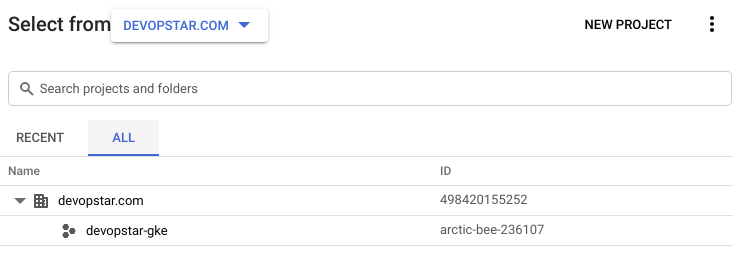

# GCP Setup

The following project structure was setup in the Web UI under a new organisation created with a billing account linked

**NOTE:** *You can just use your years free trial or alternatively just foot the extremely cheap bill to run a basic Kubernetes cluster*



## GCP SDK / CLI

### Install

I'll be installing the SDK on my Debian based OS however other instructions are available at [https://cloud.google.com/sdk/install](https://cloud.google.com/sdk/install)

```bash
# Create an environment variable for the correct distribution
$ export CLOUD_SDK_REPO="cloud-sdk-$(lsb_release -c -s)"

# Add the Cloud SDK distribution URI as a package source
$ echo "deb http://packages.cloud.google.com/apt $CLOUD_SDK_REPO main" | sudo tee -a /etc/apt/sources.list.d/google-cloud-sdk.list

# Import the Google Cloud public key
$ curl https://packages.cloud.google.com/apt/doc/apt-key.gpg | sudo apt-key add -

# Update and install the Cloud SDK
$ sudo apt-get update && sudo apt-get install google-cloud-sdk
```

You will also need kubectl for Kubernetes cluster management, you can install this using the following. There are more details about other OS installations at [https://kubernetes.io/docs/tasks/tools/install-kubectl/](https://kubernetes.io/docs/tasks/tools/install-kubectl/)

```bash
sudo apt-get install kubectl
```

### Setup

Next initialise the CLI by running the following. Note you might be prompted for a project ID, select the ID that is linked to the `devopstar-gke` project in your organisation.

```bash
$ gcloud init
# * Commands that require authentication will use contact@devopstar.com by default
# * Commands will reference project `XXXXXX-XXX-XXXXXXX` by default
# * Compute Engine commands will use region `australia-southeast1` by default
# * Compute Engine commands will use zone `australia-southeast1-a` by default
```

The alternative way to configure a project / authenticate is to run the following

```bash
# Login to GCloud
gcloud auth login

# Set the project
gcloud config set project PROJECT_ID
```

### Check

If you want to check the configurations you can find the files in `~/.config/gcloud`

```bash
ls ~/.config/gcloud
# access_tokens.db  config_sentinel  credentials.db  legacy_credentials
# active_config     configurations   gce             logs
```